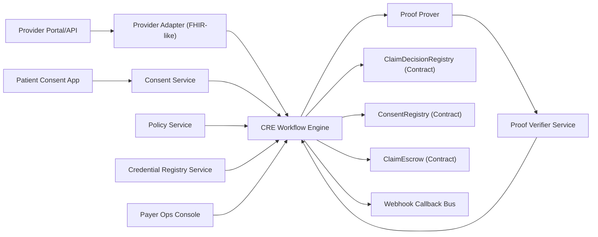

# Technical Architecture Specification: ProofPA

- Document status: Draft v0.1
- Date: March 3, 2026
- Reference PRD: `/Users/darbease/Documents/New project/PRD_ProofPA.md`
- Scope: Technical architecture for MVP (prior auth + proof-based payout)

## 1. Purpose
This document defines implementation architecture for ProofPA without changing PRD scope. It specifies smart contracts, APIs, CRE workflows, proof interfaces, security controls, and delivery constraints for a hackathon-ready MVP.

## 2. MVP Architecture Decisions
1. Execution network: EVM L2 testnet (default: Base Sepolia).
2. Settlement token: ERC-20 mock USDC on testnet.
3. Data posture: no PHI onchain; hashes/commitments/proof refs only.
4. Verification mode (MVP): proof verification offchain by verifier service, then anchored onchain with signed attestation.
5. Future mode: direct onchain proof verification (after MVP).
6. Orchestration layer: Chainlink CRE for all cross-system workflows.
7. Idempotency: all state-changing paths keyed by deterministic `claim_id`.

## 3. Component Architecture


## 4. Domain Model
## 4.1 Canonical IDs
- `subject_id_hash`: hash of patient reference identifier in source system.
- `provider_id_hash`: hash of provider identifier (NPI/DID).
- `encounter_ref_hash`: hash of encounter reference.
- `policy_hash`: hash of versioned policy payload.
- `claim_id`: `keccak256(payer_id|provider_id_hash|encounter_ref_hash|procedure_bucket|service_date)`.
- `consent_scope_hash`: hash of consent scope object (purpose + data categories + recipient).

## 4.2 Core Records
1. `ConsentRecord`
- `consent_id` (bytes32)
- `subject_id_hash` (bytes32)
- `consent_scope_hash` (bytes32)
- `issued_at` (uint64)
- `expires_at` (uint64)
- `status` (`ACTIVE | REVOKED | EXPIRED`)
- `version` (uint32)

2. `PriorAuthRequest`
- `request_id` (string/uuid)
- `claim_id` (bytes32)
- `payer_id` (string)
- `provider_id_hash` (bytes32)
- `procedure_code` (string or bucket code)
- `requested_amount` (uint256)
- `currency` (string)
- `consent_id` (bytes32)
- `attestation_ref` (URI/hash)

3. `ProofBundle`
- `proof_id` (string)
- `proof_hash` (bytes32)
- `public_inputs_hash` (bytes32)
- `verifier_key_hash` (bytes32)
- `result` (`PASS | FAIL`)
- `reason_bitmap` (uint256)

4. `ClaimDecision`
- `claim_id` (bytes32)
- `state` (`SUBMITTED | PROOF_PENDING | APPROVED | DENIED | CHALLENGED | PAID`)
- `policy_hash` (bytes32)
- `proof_hash` (bytes32)
- `reason_bitmap` (uint256)
- `updated_at` (uint64)

## 5. Smart Contract Specification
## 5.1 Roles and Access
- `WORKFLOW_ROLE`: CRE signer/service account; updates decisions and triggers payout paths.
- `POLICY_ADMIN_ROLE`: updates policy hash metadata.
- `CHALLENGE_ROLE`: payer challenge authority.
- `TREASURY_ROLE`: funds escrow pool.

All mutating methods are role-gated and emit events.

## 5.2 `ConsentRegistry.sol`
### State
- `mapping(bytes32 => ConsentRecord) consents`

### Methods
- `upsertConsent(ConsentRecordInput calldata input) external onlyRole(WORKFLOW_ROLE)`
- `revokeConsent(bytes32 consentId, uint16 reasonCode) external onlyRole(WORKFLOW_ROLE)`
- `getConsent(bytes32 consentId) external view returns (ConsentRecord memory)`
- `isConsentActive(bytes32 consentId, uint64 atTs) external view returns (bool)`

### Events
- `ConsentUpserted(bytes32 consentId, bytes32 subjectIdHash, bytes32 scopeHash, uint8 status, uint32 version)`
- `ConsentRevoked(bytes32 consentId, uint16 reasonCode, uint64 revokedAt)`

## 5.3 `PolicyRegistry.sol`
### State
- `mapping(bytes32 => PolicyVersion) policyVersions`

### Methods
- `setPolicyVersion(bytes32 policyHash, bytes32 verifierKeyHash, uint64 effectiveFrom, uint64 effectiveTo, bool active) external onlyRole(POLICY_ADMIN_ROLE)`
- `isPolicyActive(bytes32 policyHash, uint64 atTs) external view returns (bool)`

### Events
- `PolicyVersionSet(bytes32 policyHash, bytes32 verifierKeyHash, bool active)`

## 5.4 `ClaimDecisionRegistry.sol`
### State
- `mapping(bytes32 => ClaimDecision) decisions`
- `mapping(bytes32 => bool) paid`

### Methods
- `submitClaim(bytes32 claimId, bytes32 policyHash) external onlyRole(WORKFLOW_ROLE)`
- `setProofResult(bytes32 claimId, bytes32 proofHash, uint256 reasonBitmap, bool approved) external onlyRole(WORKFLOW_ROLE)`
- `challengeClaim(bytes32 claimId, uint16 reasonCode) external onlyRole(CHALLENGE_ROLE)`
- `resolveChallenge(bytes32 claimId, bool approve) external onlyRole(CHALLENGE_ROLE)`
- `markPaid(bytes32 claimId) external onlyRole(WORKFLOW_ROLE)`
- `getDecision(bytes32 claimId) external view returns (ClaimDecision memory)`

### Events
- `ClaimSubmitted(bytes32 claimId, bytes32 policyHash)`
- `ProofEvaluated(bytes32 claimId, bytes32 proofHash, bool approved, uint256 reasonBitmap)`
- `ClaimChallenged(bytes32 claimId, uint16 reasonCode)`
- `ClaimResolved(bytes32 claimId, bool approved)`
- `ClaimPaid(bytes32 claimId, address recipient, uint256 amount)`

### State Invariants
- `PAID` can only follow `APPROVED`.
- `CHALLENGED` cannot transition directly to `PAID`.
- duplicate `submitClaim` for same `claim_id` is rejected.

## 5.5 `ClaimEscrow.sol`
### State
- `IERC20 settlementToken`
- `mapping(bytes32 => PayoutInstruction) payouts`

### Methods
- `fundPool(uint256 amount) external onlyRole(TREASURY_ROLE)`
- `schedulePayout(bytes32 claimId, address recipient, uint256 amount) external onlyRole(WORKFLOW_ROLE)`
- `releasePayout(bytes32 claimId) external onlyRole(WORKFLOW_ROLE)`
- `cancelPayout(bytes32 claimId) external onlyRole(CHALLENGE_ROLE)`

### Events
- `PoolFunded(address from, uint256 amount)`
- `PayoutScheduled(bytes32 claimId, address recipient, uint256 amount)`
- `PayoutReleased(bytes32 claimId, address recipient, uint256 amount)`
- `PayoutCanceled(bytes32 claimId, uint16 reasonCode)`

## 6. Offchain Service Interfaces
## 6.1 Provider Adapter API
### `POST /v1/prior-auth/submit`
Request:
```json
{
  "request_id": "8d4651fa-94f2-4a48-b33a-85d9d8f4e550",
  "payer_id": "payer-demo-001",
  "provider_id_hash": "0x9f...ab",
  "encounter_ref_hash": "0xa2...44",
  "procedure_code": "PROC_KNEE_MRI",
  "requested_amount": "85000",
  "currency": "USDC_6",
  "consent_id": "0x77...11",
  "attestation_jws": "<signed-physician-attestation>",
  "service_date": "2026-03-03",
  "callback_url": "https://provider.example/callbacks/prior-auth"
}
```

Response:
```json
{
  "status": "ACCEPTED",
  "claim_id": "0x5e...2c",
  "workflow_id": "wf_01J..."
}
```

## 6.2 Consent Service API
### `POST /v1/consents/grant`
### `POST /v1/consents/revoke`
Both endpoints must include signed user/session context and return canonical `consent_id`.

## 6.3 Policy Service API
### `GET /v1/policies/{payer_id}/{policy_version}`
Returns machine-readable predicate set, policy metadata, and `policy_hash`.

## 6.4 Proof Service API
### `POST /v1/proofs/medical-necessity`
Request:
```json
{
  "claim_id": "0x5e...2c",
  "policy_hash": "0x01...fe",
  "predicate_inputs_ref": "s3://proofpa/predicate-inputs/claim-123.json",
  "attestation_refs": ["ipfs://...", "https://..."]
}
```

Response:
```json
{
  "proof_id": "proof_01J...",
  "proof_hash": "0xc1...99",
  "public_inputs_hash": "0x44...8a",
  "result": "PASS",
  "reason_bitmap": "0"
}
```

## 6.5 Callback API (Provider/Payer)
### `POST /v1/callbacks/prior-auth-decision`
Payload includes `claim_id`, `decision_state`, `reason_codes`, `tx_hash`, and correlation metadata.

## 7. CRE Workflow Specifications
## 7.1 `WF-001 PriorAuthDecision`
Trigger:
- HTTP request from Provider Adapter

Steps:
1. Validate payload schema and idempotency key.
2. Compute deterministic `claim_id`.
3. Read consent status from `ConsentRegistry`.
4. Pull policy metadata from Policy Service.
5. Pull provider credential status from Credential Service.
6. Invoke proof service.
7. If proof `PASS`, call `submitClaim` + `setProofResult(approved=true)`.
8. Schedule and release payout in `ClaimEscrow`.
9. Mark claim paid in `ClaimDecisionRegistry`.
10. Send callback with tx hash and state.

Failure handling:
- transient external/API failures: exponential retry (max 3 attempts).
- proof timeout: mark `PROOF_PENDING` and enqueue monitor workflow.
- onchain tx failure: retry with same idempotency key and nonce guard.

## 7.2 `WF-002 ConsentRevocation`
Trigger:
- HTTP event from Consent Service

Steps:
1. Validate revocation signature.
2. Update `ConsentRegistry` -> `REVOKED`.
3. Flag pending claim workflows using same `consent_id`.
4. Send revocation callbacks.

## 7.3 `WF-003 ChallengeResolution`
Trigger:
- HTTP event from Payer Ops Console

Steps:
1. Validate challenge role and reason code.
2. Set claim `CHALLENGED`.
3. Cancel pending payout if not released.
4. Resolve to `APPROVED` or `DENIED` after review.

## 7.4 `WF-004 ReconciliationMonitor`
Trigger:
- Scheduled (every 15 minutes in MVP)

Steps:
1. Compare offchain workflow table with onchain claim state.
2. Detect mismatches or stuck `PROOF_PENDING`.
3. Emit alerts and remediation actions.

## 8. Proof Interface Specification
## 8.1 Public Inputs
- `claim_id`
- `policy_hash`
- `consent_scope_hash`
- `provider_credential_root`
- `procedure_bucket`
- `amount_bucket`
- `encounter_nullifier`
- `service_date_epoch`

## 8.2 Predicates
- `P1`: provider credential valid at `service_date`.
- `P2`: policy covers `procedure_bucket`.
- `P3`: requested amount <= policy cap for bucket.
- `P4`: consent active and scope allows recipient/purpose.
- `P5`: encounter not previously approved (nullifier uniqueness).
- `P6`: attestation freshness within allowed window.

Proof result is valid only if `P1..P6 == true`.

## 8.3 Denial Reason Bitmap
- bit 0: provider credential invalid
- bit 1: procedure not covered
- bit 2: amount exceeds cap
- bit 3: consent invalid/revoked
- bit 4: duplicate/nullifier collision
- bit 5: stale attestation

## 9. Data Storage and Retention
## 9.1 Onchain
- consent state
- claim decision state
- payout events
- policy/version references

## 9.2 Offchain
- encrypted attestation artifacts
- proof generation inputs/witness metadata (never raw PHI in logs)
- workflow run logs with correlation IDs

## 9.3 Retention Policy (MVP)
- workflow logs: 30 days
- decision metadata: 180 days
- proof artifacts: 180 days

## 10. Security Architecture
## 10.1 Threats and Controls
1. Replay of prior-auth submissions:
- control: request nonce + deterministic `claim_id` uniqueness + signature timestamp checks.

2. Forged attestation:
- control: JWS verification against provider key registry + revocation list checks.

3. Unauthorized state mutation:
- control: role-gated contracts, multisig admin, key rotation policy.

4. Payout double-spend:
- control: one-way invariant on `paid[claim_id]`.

5. Data over-disclosure:
- control: strict schema linting and payload rejection for PHI fields not in allowlist.

## 10.2 Secrets and Key Management
- CRE signer key in managed secret store.
- Attestation issuer keys rotated every 90 days.
- Emergency key revoke and role reassignment runbook required.

## 11. Observability and SLOs
## 11.1 Correlation Model
- single `correlation_id` propagated across API request, CRE workflow, proof call, and onchain tx.

## 11.2 Metrics
- `prior_auth_decision_latency_ms`
- `proof_generation_latency_ms`
- `proof_failure_rate`
- `onchain_tx_failure_rate`
- `payout_success_rate`
- `challenge_rate`

## 11.3 SLO Targets (MVP Demo)
- p95 decision latency <= 120000 ms
- payout success >= 99% in controlled demo environment
- unresolved `PROOF_PENDING` after 15 min = 0

## 12. Environment and Deployment
## 12.1 Environments
- `local`: contract + mocks + workflow simulator
- `testnet`: Base Sepolia + test token + hosted workflow/proof services

## 12.2 Deploy Order
1. Deploy `ConsentRegistry`, `PolicyRegistry`, `ClaimDecisionRegistry`, `ClaimEscrow`.
2. Grant roles to CRE signer and ops addresses.
3. Seed policy versions and verifier key hashes.
4. Launch Provider Adapter, Policy Service, Proof services.
5. Activate CRE workflows and monitoring.

## 13. Test Strategy
## 13.1 Contract Tests
- state transition invariants
- role/permission boundaries
- payout single-release invariant

## 13.2 Workflow Integration Tests
- happy path approval + payout
- denial path with reason bitmap
- consent revoked pre-check failure
- proof service timeout recovery

## 13.3 End-to-End Demo Tests
- Scenario A: valid attestation/proof -> Approved + Paid
- Scenario B: revoked consent -> Denied (bit 3 set)
- Scenario C: challenged claim -> payout blocked

## 14. Implementation Backlog (Engineering-Ready)
1. Scaffold contracts and access roles.
2. Implement deterministic ID and schema validation library.
3. Build Provider Adapter and callback bus.
4. Implement policy service + rule parser.
5. Implement prover/verifier stub with reason bitmap.
6. Build CRE workflows `WF-001..WF-004`.
7. Add ops console (minimal) for challenge actions.
8. Add observability dashboards and alert rules.

## 15. Open Technical Decisions
1. Proof stack selection for MVP (`Groth16` vs `Plonk` vs attested non-ZK stub for speed).
2. Onchain verifier in MVP or post-hackathon phase.
3. Credential format (`VC-JWT` or `SD-JWT VC`) in first release.
4. Canonical policy DSL format and compiler strategy.
5. Target L2 final selection based on ecosystem tooling and demo reliability.

## 16. Appendix: Minimal Event Contract
All services must emit structured events:
```json
{
  "timestamp": "2026-03-03T20:00:00Z",
  "correlation_id": "corr_01J...",
  "claim_id": "0x5e...2c",
  "workflow_id": "wf_01J...",
  "stage": "proof_verified",
  "status": "success",
  "metadata": {
    "policy_hash": "0x01...fe",
    "tx_hash": "0xa8...11"
  }
}
```

This event contract is required for debugging, demo traceability, and audit replay.
