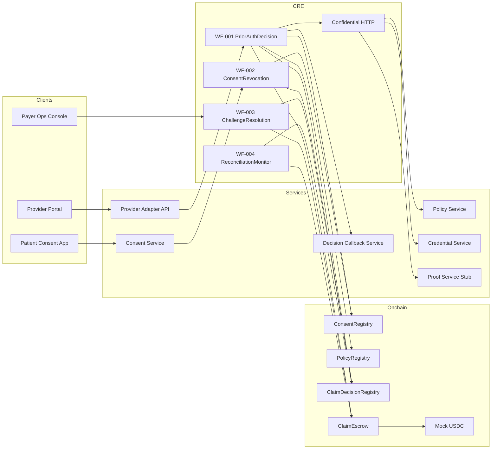

# EASE eHealth System Wiremap

## Notes
- `WF-001` is the critical path for demo outcomes.
- Onchain writes contain only minimal state and hashes, not PHI.
- Confidential HTTP is used to reduce sensitive data exposure during offchain fetches.
